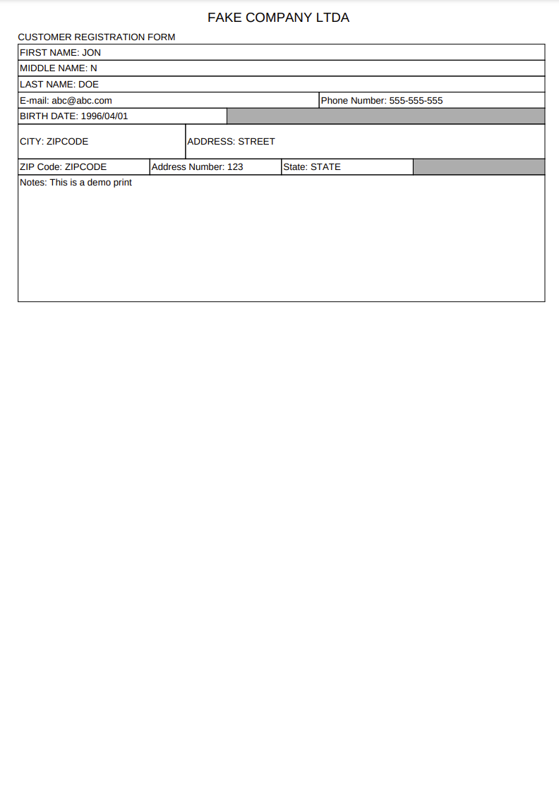

# pdf-microsservice

This microsservice is meant to receive a `template-name` and a body with print parameters and return a base64 PDF file.

- JAVA 17
- Spring Boot
- Jasper

## Install

### Docker

Run a `docker-compose up`. It will spin up the app at port 9191.

### Native

Install Java 17 locally.

Add the `pom.xml` as a Maven project. Run `ApplicationConfiguration`.

Environment variable: it's necessary to set `JASPER_PATH` env as `./assets`

If on VSCode you can use the following `launch.json`:

```json
{
    "version": "0.2.0",
    "configurations": [
        {
            "type": "java",
            "name": "ApplicationConfiguration",
            "request": "launch",
            "mainClass": "com.fnunezzz.pdfmicrosservice.ApplicationConfiguration",
            "projectName": "pdf-microsservice",
            "env": {
                "JASPER_PATH": "./assets",
              }
        }
    ]
}
```

## API

To get the PDF in base64 form the following API call is done:

`POST /pdf-microsservice/pdf/{print-name}`

The `{print-name}` is the requested print: `registration-form`. The full API demo request is `pdf-microsservice/pdf/registration-form`

The body of the request are the print data.

```json
{
    "data": {
        "client": {
            "firstName": "JON",
            "middleName": "N",
            "lastName": "DOE",
            "birthDate": "1996/04/01"
        },
        "address": {
            "street": "STREET",
            "zipCode": "ZIPCODE",
            "number": 123,
            "city": "CITY",
            "state": "STATE"
        },
        "contact": {
            "phoneNumber": "555-555-555",
            "email": "abc@abc.com"
        },
        "notes": "This is a demo print"
    }
}
```
After making the POST request you will receive a base64 file on the return object.


